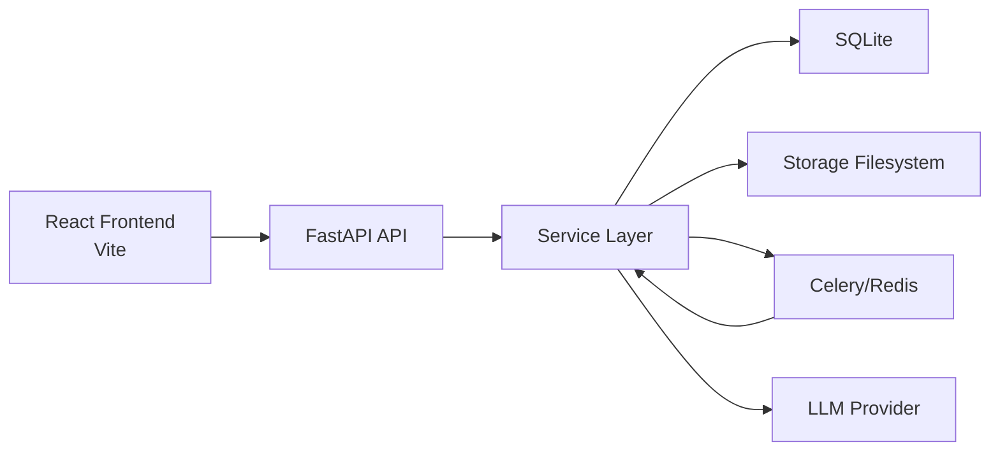

# Economist Agent 项目前置技术探索报告

- 版本：V1 技术探索稿
- 日期：2026-07-01
- 文档性质：面向项目论文写作的前置技术报告，不再是传统产品 PRD

## 1. 文档定位与改造目标

这份文档的目标，不是继续停留在“页面做什么、接口有哪些”的产品说明层，而是把 `Economist Agent` 重写为一套可支撑论文展开的技术对象。换句话说，后续论文不应只描述“系统实现了作者管理、文献上传、方法论生成和分析问答”，而应回答下面几个更核心的问题：

1. 这个系统究竟在技术上解决了什么问题。
2. 它为什么采用当前的分层架构与异步任务机制。
3. 它如何把非结构化文献逐步转化为可计算、可追踪、可复用的方法学知识。
4. 它如何在方法学知识之上进行受控问答，而不是直接做一次性生成。
5. 它的关键工程折中、鲁棒性设计、持久化策略和可扩展边界是什么。

基于当前代码，`Economist Agent` 的本质可以重新定义为：

> 一个面向经济学作者语料的异步知识加工系统。  
> 它将作者名下的文献解析为章节与段落，再将段落分析为“方法模式信号”，进一步综合为主技能与子技能快照，最后利用最新快照驱动解释型问答生成。

因此，后续论文更适合围绕“文献到知识快照的流水线构建”展开，而不是围绕“普通问答产品设计”展开。

## 2. 系统总体重定义

### 2.1 从产品视角到研究视角

原始 PRD 更像一个功能清单，强调：

- 作者管理
- 文献导入
- 段落删除
- Methodology 页面
- Analysis 页面

但从代码实现看，项目真正的核心并不是这些页面本身，而是下面这条主流水线：

`文献文件 -> 章节/段落抽取 -> 方法信号分析 -> 主技能综合 -> 子技能归纳 -> Markdown 渲染 -> 技能快照持久化 -> 基于快照的技能选择 -> 问答生成`

这意味着论文写作时，系统应被描述为一种“面向作者方法论建模的知识处理架构”。

### 2.2 系统的核心技术命题

结合现有实现，项目可以概括为以下四个技术命题：

1. 如何将 PDF/EPUB/Markdown 文献稳定抽取为章节化、段落化的中间表示。
2. 如何将段落级文本压缩成方法论信号，再上升为章节级主技能和模式级子技能。
3. 如何用快照机制管理“作者方法论知识”的版本，而不是每次问答都重新扫描全文。
4. 如何在 LLM 不稳定、任务执行可能中断、文件系统与数据库并存的情况下，保持系统流程可恢复、可轮询、可回溯。

## 3. 整体架构

## 3.1 分层结构

当前项目是一个典型的前后端分离系统，代码目录可以划分为六层：

1. 前端交互层：`frontend/src`
2. API 接入层：`backend/app/api/routes`
3. 服务编排层：`backend/app/services`
4. 领域模型层：`backend/app/domain`
5. 基础设施层：`backend/app/infra`
6. 提示词与测试层：`backend/app/prompts`、`backend/tests`

各层职责如下：

| 层级 | 代码位置 | 主要职责 |
| --- | --- | --- |
| 前端交互层 | `frontend/src/App.tsx` 与各组件 | 组织页面状态、触发 API、执行轮询、展示结果 |
| API 接入层 | `backend/app/api/routes/*.py` | 以 HTTP 接口暴露作者、文献、任务、段落等能力 |
| 服务编排层 | `backend/app/services/*.py` | 承担核心业务逻辑与流水线阶段实现 |
| 领域模型层 | `backend/app/domain/models.py`、`schemas.py`、`enums.py` | 统一数据库实体、接口结构、状态枚举 |
| 基础设施层 | `backend/app/infra/*.py` | 提供数据库、存储、Celery、配置、启动恢复能力 |
| 提示词与测试层 | `backend/app/prompts`、`backend/tests` | 固化 LLM 行为契约，并以测试覆盖关键流程 |

## 3.2 运行时拓扑



需要注意的是，这个拓扑并不是严格依赖消息队列才可运行。`job_service.py` 中的 `_dispatch_job` 实现了双通道执行策略：

- 优先使用 Celery worker 执行任务。
- 如果 worker 不可用，则回退到 API 进程内同步执行。

这说明系统的目标不是追求复杂分布式架构，而是优先保证“任务一定能跑完”。

## 3.3 启动与部署方式

部署定义主要体现在：

- `docker-compose.yml`
- `backend/app/cli.py`
- `backend/app/infra/db_recovery.py`

系统包含四个主要服务：

1. `frontend`
2. `backend`
3. `worker`
4. `redis`

其中：

- `backend` 使用 FastAPI 暴露 API。
- `worker` 使用 Celery 执行长任务。
- `redis` 同时充当 broker 与 result backend。
- `frontend` 负责用户交互。

但更重要的是启动过程中的两步“自修复”：

1. 启动时自动执行 Alembic migration。
2. 若数据库为空但 `storage/authors` 下存在可恢复数据，则自动从文件系统重建数据库。

这意味着系统采用了“数据库 + 文件系统双重持久化”的混合策略，且将文件系统视为可恢复事实源之一。

## 4. 数据模型与持久化设计

## 4.1 核心数据库实体

数据库实体定义在 `backend/app/domain/models.py`。

### 4.1.1 `Author`

作用：表示一个经济学作者档案。

关键字段：

- `author_id`
- `author_name`
- `school`
- `language`
- `avatar_url`
- `created_at`
- `updated_at`

技术意义：作者是整个系统的一级命名空间，文献、任务、快照、回答都挂在作者下面。

### 4.1.2 `AuthorDocument`

作用：记录作者名下文献及其处理状态。

关键字段：

- `document_id`
- `author_id`
- `book_title`
- `pdf_uri`
- `status`

`status` 在当前系统中至少承担三种含义：

- `processing`
- `active`
- `failed`

它既是文献状态，也是后续方法学流水线是否可见的过滤条件，因为 `pipeline_service._load_author_segments()` 只会读取 `active` 文献对应的段落。

### 4.1.3 `DocumentChapter`

作用：表示抽取后的章节。

关键字段：

- `chapter_id`
- `document_id`
- `chapter_title`
- `order_index`
- `is_deleted`

这里采用的是软删除而不是直接清空，说明系统允许用户对结构化文献结果进行“筛除式整理”。

### 4.1.4 `DocumentSegment`

作用：表示章节下的段落片段。

关键字段：

- `segment_id`
- `document_id`
- `chapter_id`
- `chunk_id`
- `content`
- `order_index`
- `is_deleted`

其中 `chunk_id` 很关键。它不是 LLM 分析阶段的 chunk，而是文档抽取阶段生成的段落唯一标识。后续方法分析时，会重新把这些段落组装成更大的分析块。

### 4.1.5 `AuthorSkillSnapshot`

作用：保存作者方法学技能快照。

关键字段：

- `snapshot_id`
- `author_id`
- `is_latest`
- `outputs_json`
- `created_at`

这是整个系统最重要的知识持久化实体。它意味着：

- 方法学不是临时结果，而是可版本化的知识产物。
- 问答不直接依赖原始文献，而依赖“最近一次有效技能快照”。

### 4.1.6 `PipelineJob`

作用：统一表示所有异步任务。

关键字段：

- `job_id`
- `author_id`
- `document_id`
- `job_type`
- `status`
- `current_stage`
- `progress`
- `query`
- `model_config_json`
- `snapshot_id`
- `outputs_json`
- `error_message`
- `finished_at`

这张表把“文档重载”“技能生成”“问答生成”全部统一到一个状态机里，是系统可观测性的核心。

## 4.2 状态与枚举

枚举定义在 `backend/app/domain/enums.py`。

### 4.2.1 任务类型 `JobType`

- `author_skills`
- `document_reload`
- `author_answer`

### 4.2.2 任务状态 `JobStatus`

- `queued`
- `running`
- `success`
- `failed`
- `canceled`

### 4.2.3 流水线阶段 `Stage`

- `extract`
- `segment_sync`
- `analyze`
- `main_skill`
- `sub_skill`
- `render`
- `select_skills`
- `answer`

这些阶段名本身就构成了论文中的“流程骨架”。

### 4.2.4 输出物类型 `OutputType`

对外可读的重要产物包括：

- `main_skill_json`
- `sub_skill_json`
- `method_analysis_json`
- `answer_json`
- `main_skill_md`
- `main_skills_md_json`
- `sub_skills_md_zip`
- `sub_skills_md_json`

这里最值得注意的是：系统不只保存 JSON，还保存 Markdown 化产物。这说明它既服务于程序消费，也服务于人类阅读与再利用。

## 4.3 文件系统存储布局

文件系统封装在 `backend/app/infra/storage.py` 中，结构按作者分区，大致如下：

```text
storage/
  authors/
    {author_id}/
      author_meta.json
      avatar.*
      documents/
        {document_id}/
          source.pdf|source.epub|source.md
          document_meta.json
          extracted_segments.json
      snapshots/
        {snapshot_id}/
          snapshot_meta.json
          method_analysis.json
          main_skill.json
          sub_skill.json
          main_skills_md.json
          sub_skills_md.json
          sub_skills_md.zip
      answers/
        {job_id}/
          answer.json
      jobs/
        {job_id}/
          document_reload_report.json
```

这种布局对应了三个设计意图：

1. 作者是持久化命名空间。
2. 快照与回答是相互独立的产物域。
3. 即使数据库损坏，也可从文件系统最大程度恢复系统状态。

## 5. API 契约与前后端协作方式

## 5.1 统一响应包裹

定义在 `backend/app/domain/schemas.py` 中，所有 API 统一采用：

- `success`
- `data`
- `error`
- `requestId`
- `timestamp`

这意味着：

- 接口风格统一。
- 前端错误处理可以集中化。
- 请求链路具备基础追踪能力。

## 5.2 鉴权方式

鉴权逻辑在 `backend/app/api/deps.py`，采用单一请求头：

- `X-API-Key`

当后端未配置 `API_KEY` 时，可视为关闭鉴权。

这是一种明显偏研究原型而非多租户平台的设计，也与 V1 的定位一致。

## 5.3 前端调用模式

前端 API 封装在：

- `frontend/src/api/backend.ts`
- `frontend/src/api/client.ts`
- `frontend/src/api/poller.ts`

其特点是：

1. 非流式，统一走 REST。
2. 长任务统一通过 `pollJob()` 轮询。
3. GET/HEAD 请求支持简单重试。
4. 前端可按任务拉取 outputs，而不是一次拿全量产物。

这与原 PRD 中“V1 不使用 SSE/WebSocket”的方向完全一致，并且已经在代码层面固化。

## 6. 核心流程一：文献导入与 `document_reload`

这一流程对应论文中“原始文献结构化预处理”部分。

## 6.1 入口

API 入口：

- `POST /api/authors/{author_id}/documents`
- `POST /api/authors/{author_id}/documents/upload`
- `POST /api/authors/{author_id}/documents/{document_id}/reload`

对应实现：

- `backend/app/api/routes/authors.py`
- `backend/app/services/author_service.py`

## 6.2 文档创建与任务触发

在 `author_service.py` 中：

- 如果是直接传 `pdf_uri`，调用 `_create_document_with_reload_job()`。
- 如果是上传文件，`upload_document_file()` 会先把原文件保存到 `storage/documents/{document_id}/source.*`，再创建 `AuthorDocument` 和重载任务。

这里的重要设计是：文献记录创建与文档重载任务创建被强绑定。也就是说，系统把“上传”视为“进入待结构化状态”，而不是单纯保存文件。

## 6.3 任务派发机制

重载任务由 `job_service.create_document_reload_job()` 创建。

该函数会：

1. 把 `AuthorDocument.status` 置为 `processing`。
2. 创建 `PipelineJob`，初始阶段为 `extract`。
3. 根据环境选择 Celery 执行或进程内回退执行。

这说明任务系统并不是附加功能，而是后端执行模型本身。

## 6.4 文档抽取阶段 `extract`

具体执行函数：

- `pipeline_service.run_document_reload()`
- `extract_paragraphs.run_extract_paragraphs()`

抽取支持三种文档类型：

- PDF
- EPUB
- Markdown

分发逻辑在 `backend/app/services/extract_paragraphs.py`。

## 6.5 PDF 抽取实现逻辑

PDF 抽取是整个预处理链中最复杂的一步，关键代码在 `extract_paragraphs_pdf.py`。

### 6.5.1 章节识别策略

系统采用三级回退策略识别章节：

1. 优先读取 PDF 自带 outline / TOC。
2. 若无 outline，则从目录页文本中识别章节与页码。
3. 若仍失败，则根据规则匹配 `Chapter n`、`Part n`、`1.`、`IV.` 等标题模式。
4. 全部失败时，把整本文献视为 `Full Book`。

这是一种非常实用的鲁棒设计。它不依赖单一来源，而是允许半结构化 PDF 在缺乏规范元数据时继续被解析。

### 6.5.2 正文块重建策略

系统不会直接把 PDF 每一行视为段落，而是经过：

1. 行级文本抽取
2. 页眉页脚过滤
3. 上标数字与脚注痕迹清理
4. 基于行间距、缩进、断句和版面宽度的块合并
5. 噪声段落过滤

这一逻辑表明：项目并非“文件上传 + LLM 全文吃入”的简单架构，而是认真构建了可解释的文本重建层。

### 6.5.3 段落归一化

公共清洗逻辑在 `extract_paragraphs_common.py`，包括：

- 连字符换行修复
- 单换行转空格
- 过多换行压缩
- 行内脚注清理
- 过短噪声、纯编号、纯页码过滤
- 跨段合并

论文中可以把这一层定义为“面向方法学抽取的文本标准化模块”。

## 6.6 EPUB 与 Markdown 抽取

当前代码还支持：

- `extract_paragraphs_epub.py`
- `extract_paragraphs_md.py`

这说明系统并未把“文献”狭义理解为 PDF，而是已经抽象为“可结构化文本载体”。

## 6.7 章节与段落回写 `segment_sync`

文档抽取后，`pipeline_service._upsert_chapters_and_segments()` 负责把结果写回数据库。

其策略不是全量删库重建，而是：

1. 按章节标题 upsert `DocumentChapter`
2. 按 `chunk_id` upsert `DocumentSegment`
3. 对已软删除章节采用跳过策略
4. 对已软删除段落不强行恢复

这意味着系统在“自动重载”与“人工筛删”之间做了一个明确折中：重载更新结构，但尊重人工删除结果。

## 6.8 文档状态收敛

`run_document_reload()` 成功后会：

- 将 job 状态设为 `success`
- 将文档状态置为 `active`
- 写出 `document_reload_report.json`

失败时则会把文档状态设为 `failed`。

此外，`document_status_service.py` 提供了 `reconcile_stale_processing_documents()`，用于修复“文档还在 processing，但对应 reload job 已不存在或终止”的异常状态。这是系统鲁棒性的重要细节。

## 7. 核心流程二：Methodology 生成与技能快照构建

这一流程是项目最适合写进论文的方法学主轴。

## 7.1 任务入口

API：

- `POST /api/authors/{author_id}/jobs/skills`

服务入口：

- `job_service.create_author_skills_job()`
- `pipeline_service.run_author_skills()`

其本质不是“生成一份报告”，而是“生成并持久化作者级方法学知识快照”。

## 7.2 输入数据选择：只读取激活文献的未删除段落

`pipeline_service._load_author_segments()` 会做三层过滤：

1. 只读取 `AuthorDocument.status == active` 的文献。
2. 只读取未删除章节。
3. 只读取未删除段落。

这说明 Methodology 不是对“原始全部文献”做静态分析，而是对“用户清洗后的有效语料”做分析。

## 7.3 章节上下文建模

在 `run_author_skills()` 中，系统会先构造：

- `section_contexts`
- `section_title_contexts`

其作用是为每个章节补足：

- `document_id`
- `book_title`
- `chapter_title`

这套 `source_context` 机制很关键，因为后续主技能、子技能、Markdown 产物和前端 Methodology 页面都依赖它来完成知识溯源。

## 7.4 增量式技能生成，而不是每次全量重算

当前实现最值得写进论文的一个点，是技能生成不是粗暴全量重建，而是显式增量式：

1. 读取最新快照中已经生成过的 `section_id`。
2. 找出尚未生成的方法学章节。
3. 从剩余章节中按批次抽样生成。
4. 将新生成结果合并进已有快照。

相关实现：

- `_load_generated_section_history()`
- `_sample_sections_for_generation()`
- `_assign_new_main_skill_ids()`
- `_merge_and_trim_main_skills()`

这说明作者方法学知识被看作一种“持续累积资产”，不是一次性离线结果。

## 7.5 章节采样策略

`_sample_sections_for_generation()` 并不是简单取前 N 个章节，而是优先保证文献覆盖面。这一点可从测试名 `test_generation_prioritizes_book_coverage_before_same_book_extra_sections` 看出。

这意味着系统在方法学构建阶段引入了“跨文献代表性优先”的启发式策略，其目标不是局部最优，而是先构成更均衡的作者方法论外轮廓。

## 7.6 阶段 A：`analyze`

实现位于 `analyze_method_chunks.py`。

### 7.6.1 输入转换

系统先将段落记录标准化为 `ParagraphRecord`，提取：

- `chunk_id`
- `content`
- `chapter_id`
- `chapter_title`

### 7.6.2 按词数分块

系统使用 `method_chunk_max_words` 控制分块上限，默认来自 `settings.py`。

分块逻辑特点：

- 超长单段可独立成块
- 普通段落按词数上限累计
- 每块保留其归属章节

这一步对应论文中的“段落到分析块的中间压缩”。

### 7.6.3 LLM 输出目标

每个分析块会通过提示词 `method_analysis_prompt.md` 或其中文版，抽取两类结构：

1. `methodPatterns`
2. `methodSignals`

其中至少包含：

- `raw_pattern`
- `normalized_pattern`
- `actions`
- `method_program`
- `perspective`
- `nature`
- `time_orientation`
- `system_scope`
- `equilibrium_view`
- `logic`

从论文角度看，这一步实现了“段落级方法信号识别”。

## 7.7 阶段 B：`main_skill`

实现位于 `main_skill.py`。

### 7.7.1 从 chunk 到 section

该阶段会先把 `method_analysis.chunks` 解析成 `ChunkMethodRecord`，再按 `(section_id, section_title)` 分组。

也就是说，主技能的归纳粒度是章节级，而不是整作者级或全文级。

### 7.7.2 中间载荷构造

每个章节会被压缩成一个中间 JSON：

- `raw_pattern_chain`
- `method_signals_chain`

这一步非常适合写进论文，因为它说明系统不是直接把原文交给模型“总结”，而是先把前序模型输出整理为更高层的结构化证据链。

### 7.7.3 主技能输出结构

经过 LLM 综合后，每个主技能应包含两大部分：

1. `pattern_summary`
2. `signal_summary`

典型字段包括：

- `name`
- `description`
- `applicability`
- `core_steps`
- `pattern_flow`
- `chapter_method_summary`
- 各类 signal 的 `value` 与 `notes`
- `confidence`

这说明主技能本质上是“章节级方法模板”。

## 7.8 阶段 C：`sub_skill`

实现位于 `sub_skill.py`。

### 7.8.1 分组逻辑

子技能不是按章节直接生成，而是按：

- `section_id`
- `main_skill_id`
- `normalized_pattern`

进行聚合。

这意味着子技能代表的是“主技能下某一稳定方法模式的细分操作抽象”。

### 7.8.2 子技能结构

标准输出字段包括：

- `name`
- `description`
- `abstract_action_chain`
- `method_program_summary`
- `source_chunk_ids`
- `method_program_example`

从论文角度说，主技能提供章节级方法框架，子技能则提供模式级可调用单元。

## 7.9 阶段 D：`render`

实现位于 `render.py`。

这里并没有把 JSON 直接暴露给前端，而是进一步渲染为 Markdown 技能文档：

- 主技能 Markdown
- 子技能 Markdown
- 主技能 Markdown 索引 JSON
- 子技能 Markdown 索引 JSON
- 子技能 ZIP

这一层的技术意义是把“模型产出的结构化知识”转化为“可复用知识资产”，便于：

- 前端展示
- 问答上下文拼装
- 人工阅读
- 未来外部系统接入

## 7.10 快照存储与版本切换

`pipeline_service._store_author_skill_artifacts()` 会把本次生成结果写入新 `snapshot_id` 目录下。

随后：

1. 将旧 `is_latest=True` 的快照全部置为 `False`
2. 新建 `AuthorSkillSnapshot`
3. 将新快照标记为唯一最新快照
4. 将当前 job 与该 snapshot 关联

这说明系统采用了“多快照保留 + 单最新指针”的版本模型，非常适合论文里描述“知识版本管理”。

## 8. 核心流程三：Answer 生成

这一流程对应论文中的“基于方法学快照的受控问答”。

## 8.1 任务入口

API：

- `POST /api/authors/{author_id}/jobs/answer`

执行入口：

- `job_service.create_author_answer_job()`
- `pipeline_service.run_author_answer()`

## 8.2 依赖最新快照，而不是回扫原文

`run_author_answer()` 首先做的不是读取段落，而是读取作者最新 `AuthorSkillSnapshot`。

随后从快照中提取：

- `main_skill_json`
- `sub_skill_json`
- 可选 `main_skills_md_json`
- 可选 `sub_skills_md_json`

这说明问答阶段的知识基础已经从“原始文献”转移到了“方法学资产层”。

## 8.3 技能选择阶段 `select_skills`

实现位于 `select_skills.py`。

### 8.3.1 候选模板构建

系统会从主技能里抽出一个轻量模板集合，每项至少包含：

- `skill_index`
- `section_id`
- `name`
- `description`
- `applicability`

### 8.3.2 两段式选择机制

选择机制不是纯 LLM，也不是纯规则，而是：

1. 先按 query 与技能模板做召回排序。
2. 让 LLM 从召回候选中返回 `skill_indices`。
3. 若 LLM 不可用、JSON 非法、返回超范围、重复或超量，则回退到规则排序结果。

这是一种典型的“LLM 决策 + 规则兜底”结构。它比全依赖生成更稳，也比纯关键词匹配更灵活。

### 8.3.3 多技能选择

系统不是只允许选 1 个技能。`skills_select_count` 控制最多选几个章节技能。因此回答可以建立在多个章节方法框架之上。

## 8.4 答案上下文构造

实现位于 `answer_with_skills.py`。

上下文构造存在明确优先级：

1. 优先使用 Markdown 产物构造上下文。
2. 若 Markdown 不可用，再退回 JSON 摘要上下文。

这意味着系统认为经过渲染的技能文档比原始 JSON 更适合作为回答上下文。

## 8.5 回答生成

回答生成输出的严格结构为：

- `title`
- `topic`
- `summary`
- `markdown`

同时还会附加：

- `selectedSkillIndices`
- `selectedSectionIds`
- `selectedMainSkillNames`
- `selectedSubSkillNames`
- `selectionMode`
- `selectionWarning`

这使得回答不仅有内容，还有“方法来源说明”，提升了结果的可解释性。

## 8.6 直接 API 基线回答

`run_author_answer()` 在生成技能驱动回答的同时，还会额外生成 `direct_api_article`。

这个设计极有论文价值，因为它天然提供了一个对照组：

- 一条路径：基于方法学快照生成回答
- 另一条路径：不使用快照，直接一次性生成文章

这为后续论文中的实验比较、案例分析、质量对照提供了天然接口。

## 8.7 回答产物存储

最终回答会写入：

- `storage/authors/{author_id}/answers/{job_id}/answer.json`

并记录为 `answer_json` 类型的公开输出。

回答历史由 `PipelineJob` 本身承载，而非单独建表，这体现了“任务即历史记录”的设计思想。

## 9. 前端架构与交互路径

## 9.1 单一应用壳

前端主入口是 `frontend/src/App.tsx`。

虽然页面上是多个功能区，但从代码上看，整个系统由一个顶层应用壳统一管理状态，主要维护：

- 作者列表
- 文档列表
- 章节列表
- 段落列表
- Methodology 产物
- Analysis 历史
- 当前运行任务

这使前端实际上承担了“轻量 orchestration layer”的角色。

## 9.2 页面与后端能力的映射

当前主要标签页包括：

- `archive`
- `analysis`
- `methodology`
- `answer`

需要注意一个实现细节：`analysis` 这个 tab 在代码中实际对应的是“段落/章节管理视图”，即 `SegmentSidebar + SegmentView`。这说明命名上仍有历史痕迹，论文写作时应统一称其为“Segment 管理”或“结构化语料管理”。

## 9.3 Methodology 页面如何解析章节归属

`frontend/src/methodologySource.ts` 实现了一套前端侧章节解析逻辑，用于把快照中的主技能 section 与当前文献库映射起来。

它会结合：

- `section_id`
- `source_context`
- `book_title`
- `chapter_title`
- 当前文档/章节索引

去判断一个 Methodology section 是否仍能对应到现存文献。这说明前端并不是盲目展示快照，而是在做一次“快照知识与当前文献库的对齐”。

## 9.4 轮询与进度展示

前端 `pollJob()` 的轮询间隔默认为 2 秒，超时 10 分钟。

配合后端实时更新的 `progress` 和 `currentStage`，页面可以展示长任务进度。

当前核心阶段的可见进度大致为：

- `document_reload`: `extract -> segment_sync`
- `author_skills`: `analyze(35) -> main_skill(55) -> sub_skill(70) -> render(85) -> success(100)`
- `author_answer`: `select_skills(40) -> answer -> success(100)`

从论文角度看，这不是 UI 小细节，而是系统可观测性的体现。

## 9.5 Undo/Redo 的真实语义

Segment 页面支持 Undo/Redo，但当前实现仅在前端内存层维护 `segmentHistory`。

也就是说：

- 用户删除章节/段落时，前端立即更新视图并保存快照。
- 真正的后端删除仍会执行。
- Undo/Redo 是界面级可逆，不是数据库级事务回滚。

因此论文中不能把它写成“持久化撤销系统”，而应诚实表述为“前端交互级历史回放”。

## 10. 任务系统与执行模型

## 10.1 统一任务驱动

`job_service.py` 把三类核心任务统一进一个接口模型：

- 创建任务
- 执行任务
- 查询任务
- 重试任务
- 取消任务
- 读取任务输出

这使系统具备高度一致的任务管理语义。

## 10.2 输出读取白名单

`job_service.get_output()` 并不会允许任意文件直接暴露，而是通过 `OutputType` 白名单过滤可读产物。

这是一个轻量但明确的边界控制：

- 前端能读哪些产物，由后端显式枚举。
- 文件系统虽然是开放持久化层，但 API 输出是受控的。

## 10.3 重试与取消语义

当前规则为：

- 只有 `failed` 或 `canceled` 的任务可以 `retry`
- `success / failed / canceled` 不可再 `cancel`
- `queued / running` 的任务可取消

这保证了状态机语义的清晰性。

## 10.4 无 worker 回退执行

`_dispatch_job()` 会先 `ping` worker。

若无 worker：

- `document_reload` 直接在 API 进程内执行
- `author_skills` 直接在 API 进程内执行
- `author_answer` 直接在 API 进程内执行

这是一种实用主义设计，适合论文中作为“原型系统可用性优先”的工程选择来解释。

## 11. 配置、模型调用与多语言支持

## 11.1 全局配置

`backend/app/infra/settings.py` 提供全局配置，包括：

- `provider`
- `model_name`
- `api_base`
- `deepseek_api_key`
- `database_url`
- `redis_url`
- `storage_root`
- `method_chunk_max_words`
- `skills_batch_size`
- `skills_max_main_skills`
- `skills_select_recall_limit`
- `skills_select_count`

## 11.2 请求级模型覆盖

前端设置弹窗最终会把 `modelConfig` 透传给后端任务创建接口。

后端通过：

- `job.model_config_json`
- `llm_utils.model_config_override_scope()`

把请求级模型配置临时覆盖到当前任务执行上下文。

这意味着系统既支持全局默认模型，也支持按任务精细指定模型。

## 11.3 API Key 校验策略

对 LLM 任务，`job_service._require_model_api_key()` 会在创建任务前检查当前请求是否具备可用 key。

这一步不是在真正调用模型时才失败，而是在任务入队之前就进行预判，从而减少无意义任务。

## 11.4 中英文双提示词体系

`llm_utils.localized_prompt_filename()` 与 `load_prompt_by_language()` 支持根据作者语言自动切换：

- 英文 prompt
- 中文 `_zh` prompt

这意味着系统语言不是前端展示层参数，而是深度进入了后端知识抽取和回答生成流程。

## 12. 删除、修订与知识一致性策略

## 12.1 段落与章节删除

`segment_service.py` 对章节和段落采用软删除：

- `is_deleted = True`
- `deleted_at` 记录时间

后续的技能生成只读取未删除内容，因此删除实际上影响的是未来知识快照，而不强行回滚历史结果。

## 12.2 删除文档对最新快照的影响

`author_service.delete_document()` 不只是删文档本身，还会调用 `_drop_document_from_latest_snapshot()`，把该文档对当前最新 Methodology 快照的贡献清除掉。

这一步会同时改写：

- `main_skill_json`
- `sub_skill_json`
- `method_analysis_json`
- `main_skills_md_json`
- `sub_skills_md_json`
- `sub_skills_md.zip`

这说明系统对“知识来源被撤销”这一场景有明确处理，而不是简单留下污染快照。

## 12.3 删除 Methodology section

`delete_main_skill_section()` 则提供更细粒度的快照修订能力。

这代表一种非常重要的研究型交互：

- 用户不必重跑整套技能生成
- 可以先手工剔除不满意章节
- 之后再通过下一次技能任务增量补回

这为论文中的“人机协同修订机制”提供了真实实现基础。

## 12.4 源上下文回填

`pipeline_service.upgrade_snapshot_source_contexts()` 会在读取旧快照输出时尝试补写 `source_context`。

这说明系统已经开始处理“历史快照结构演进”问题，即快照 schema 不是完全静态的。

## 13. 启动恢复与可恢复性设计

## 13.1 启动时自动迁移

通过 `db_recovery.bootstrap_database_on_startup()`，系统会在启动阶段自动执行：

- Alembic migration

这保证数据库 schema 不依赖手工维护。

## 13.2 文件系统到数据库的自动重建

若满足两个条件：

1. 数据库核心表为空
2. `storage/authors` 下存在可恢复数据

系统会自动执行 `rebuild_db_from_storage`。

这在研究原型系统里非常重要，因为：

- 文件系统产物通常是最直接的执行结果
- 数据库更像索引与调度层
- 当数据库损坏时，仍可借助产物目录恢复大部分状态

## 13.3 存储清单文件的作用

作者、文档、快照都会写清单 JSON，例如：

- `author_meta.json`
- `document_meta.json`
- `snapshot_meta.json`

这些清单文件既服务运行时，也服务恢复脚本，是一种“轻元数据账本”。

## 14. 测试覆盖与工程成熟度

当前测试目录 `backend/tests` 已经覆盖了不少关键行为，说明项目已具备一定工程完整性。

重点测试主题包括：

- 作者创建、重命名、删除
- 文档上传、重载与失败处理
- PDF/EPUB/Markdown 抽取
- 技能快照生成与增量合并
- 技能选择逻辑回退
- Answer 输出结构
- 删除文档后快照清洗
- 启动恢复与数据库重建
- 任务进度可见性

特别值得关注的测试方向有：

- `test_skills_incremental_generation.py`
- `test_skills_progress_visibility.py`
- `test_methodology_main_skill_delete.py`
- `test_answer_with_skills_context.py`
- `test_rebuild_db_from_storage.py`

这些测试说明当前实现已经不再是概念 demo，而是围绕“增量生成、上下文可追踪、恢复机制、输出稳定性”做了明确验证。

## 15. 适合论文展开的技术主线

基于当前实现，后续论文最适合从以下五条主线展开。

## 15.1 主线一：面向经济学作者语料的方法学知识加工流水线

核心问题：

- 如何把非结构化文献转成可计算的方法学表示。

对应代码主轴：

- `extract_paragraphs*.py`
- `analyze_method_chunks.py`
- `main_skill.py`
- `sub_skill.py`

## 15.2 主线二：快照式作者方法论知识库构建

核心问题：

- 为什么不直接问原文，而要建立方法学快照。

对应代码主轴：

- `AuthorSkillSnapshot`
- `_store_author_skill_artifacts()`
- `run_author_skills()`

## 15.3 主线三：受控问答与直接生成的双路径比较

核心问题：

- 方法学驱动回答与一次性直接生成相比，有什么结构性优势。

对应代码主轴：

- `select_skills.py`
- `answer_with_skills.py`
- `direct_api_article.py`

## 15.4 主线四：面向长任务的可观测异步执行机制

核心问题：

- 如何让文献解析、技能生成、问答生成在研究原型中既稳定又可追踪。

对应代码主轴：

- `PipelineJob`
- `job_service.py`
- `stage_runners.py`
- 前端 `poller.ts`

## 15.5 主线五：数据库与文件系统并行持久化下的恢复与修订

核心问题：

- 当系统既保存结构化索引，也保存原始产物时，如何保证恢复、删除和增量修订的一致性。

对应代码主轴：

- `storage.py`
- `db_recovery.py`
- `author_service.py`
- `document_status_service.py`

## 16. 当前实现的关键优点

从论文评价角度看，当前系统至少有以下优势：

1. 不直接把 LLM 当黑盒问答器，而是先构建可追踪的知识中间层。
2. 使用统一任务模型组织不同长流程，状态机清晰。
3. 对文档抽取阶段做了较完整的工程化处理，尤其是 PDF 文本重建。
4. 使用快照而非即时全文搜索，使方法学资产可沉淀、可版本化。
5. 在技能选择阶段采用“LLM + 规则兜底”，兼顾灵活性与稳定性。
6. 具备数据库损坏后的自动恢复思路，不是一次性脆弱 demo。

## 17. 当前实现的局限与论文中应诚实说明的问题

同样重要的是，论文中需要诚实呈现当前局限。

## 17.1 章节级主技能仍然较粗

当前主技能的聚合粒度是章节，不是主题簇或跨章节模式簇。因此：

- 当章节内部主题过杂时，主技能可能过宽。
- 当同一方法论跨章节出现时，目前仍被切开处理。

## 17.2 选择阶段仍偏启发式

`select_skills.py` 的召回与 fallback 仍以 token 命中为主，尚未引入向量检索或更丰富的语义索引。

## 17.3 前端 Undo/Redo 不是持久事务

这会影响“用户修订轨迹”的严格可复现性。

## 17.4 任务进度是阶段式而非细粒度

当前 progress 更像“里程碑百分比”，不是实时工作量估计。

## 17.5 快照修订目前集中作用于 latest

无论文档删除还是 section 删除，核心逻辑都主要围绕“最新快照”展开，历史快照不会被连带重写。这是合理选择，但也意味着历史版本管理仍偏轻量。

## 18. 建议的论文章节映射

如果要把这套项目发展为论文，建议按如下结构组织。

### 第一章：研究背景与问题定义

- 经济学作者文献分析为何需要方法学中间层
- 直接问答模式的局限
- 本文提出的作者方法学快照框架

### 第二章：系统总体架构设计

- 前后端分层
- 异步任务系统
- 数据库与文件系统双持久化
- 运行时部署结构

### 第三章：文献结构化预处理方法

- PDF/EPUB/Markdown 抽取
- 章节识别
- 段落重建
- 噪声清洗与标准化

### 第四章：方法学知识抽取与技能快照构建

- 段落分块
- `method_analysis` 信号抽取
- 主技能综合
- 子技能归纳
- Markdown 知识资产渲染
- 快照版本管理

### 第五章：基于技能快照的受控问答机制

- 技能模板召回
- LLM 选择与规则回退
- 回答上下文构造
- 技能驱动回答与直接生成回答对照

### 第六章：系统鲁棒性与工程实现

- 任务轮询机制
- 失败恢复
- stale document reconciliation
- 数据恢复与重建
- 删除/修订一致性策略

### 第七章：实验、案例与讨论

- 不同作者的技能快照案例
- 技能驱动回答与直接回答对比
- 删除章节或文档后的快照变化
- 当前局限与未来工作

## 19. 结论

结合当前代码，`Economist Agent` 已经不是一个简单的“上传文献然后提问”的应用，而是一套围绕“作者方法论建模”展开的知识加工系统。它的真正技术价值不在页面数量，而在于：

1. 用结构化预处理把文献变成章节与段落资产。
2. 用多阶段 LLM 流水线把段落压缩为方法学信号、主技能和子技能。
3. 用快照机制让作者方法论从瞬时生成物变成可版本化知识库。
4. 用受控技能选择与上下文构造，让问答建立在方法学资产之上。

因此，后续论文最应聚焦的，不是“我们做了一个前后端系统”，而是：

> 我们如何设计并实现了一套面向经济学作者语料的异步方法学知识抽取、快照沉淀与受控问答框架。

